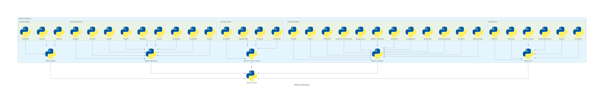

# Python Community 

Estrutura de eventos pelo brasil, regionais, locais e nacionais.



## Para instalar: 

```
python -m venv .venv
source .venv/bin/activate
pip install -r requirements.txt
python diagrams.py

```


## Para atualizar: 

```
python diagrams.py

```

